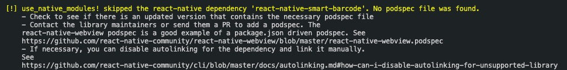
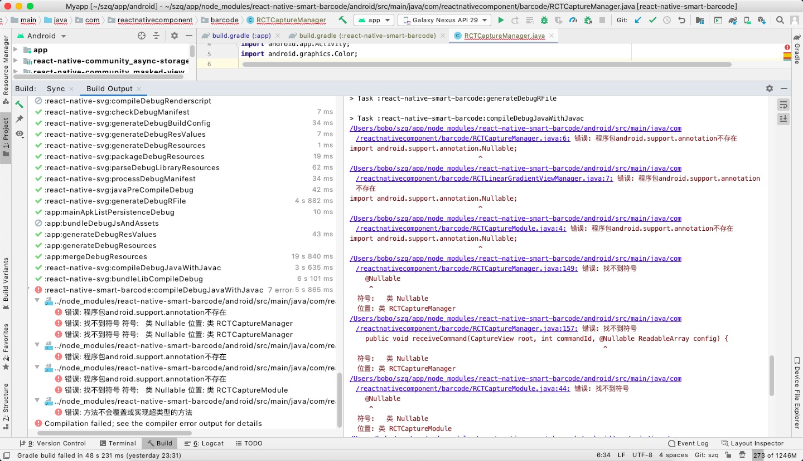
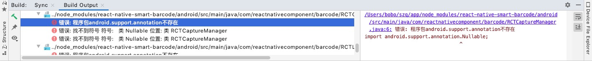
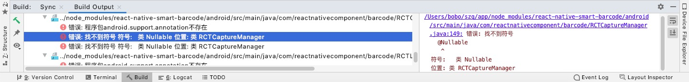
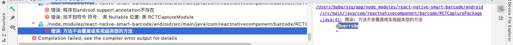
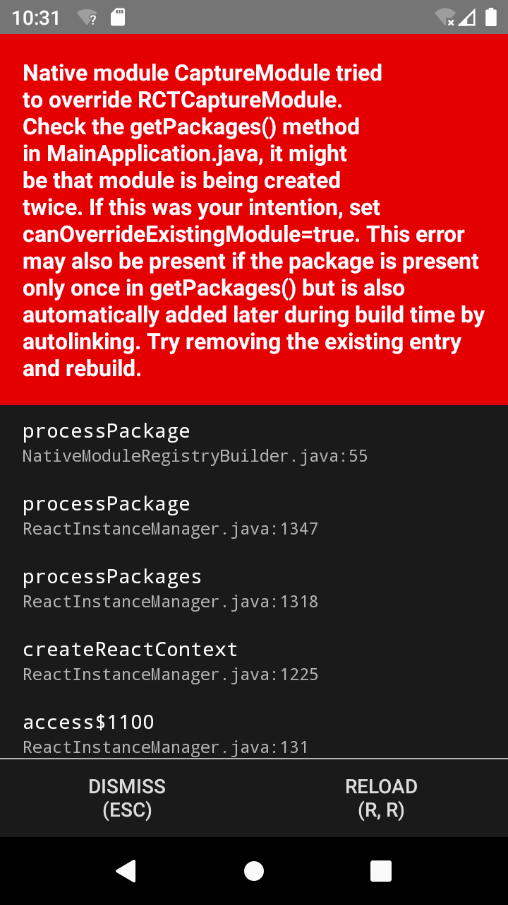
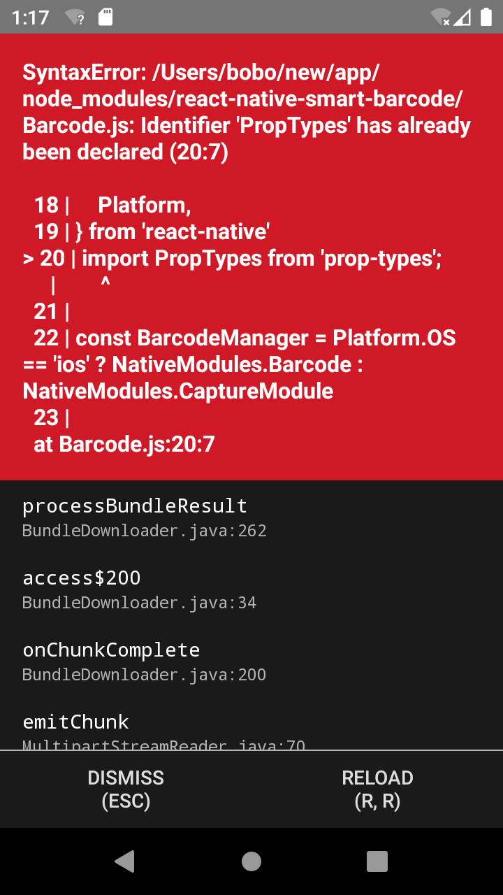

# react-native-smart-barcode

用于React Native应用程序的智能条形码扫描器组件。该库使用https://github.com/zxing/zxing来解码android的条形码，并且还支持ios。

https://www.npmjs.com/package/react-native-smart-barcode-ry

https://github.com/react-native-component/react-native-smart-barcode#readme


## 安装

```shell
npm install react-native-smart-barcode --save
npm install react-native-smart-timer-enhance --save // 用到的另一个组件
```


## 注意

- 该组件不支持``pod install``

```shell
[!] use_native_modules! skipped the react-native dependency 'react-native-smart-barcode'. No podspec file was found.
```



- 该组件仅适用于react-native 0.4.0以上的ios，如果要使用小于react-native 0.4.0的软件包，请使用 `npm install react-native-smart-barcode@untilRN0.40 --save`

* ios 使用自带支持的扫码解析功能, 但扫条码的有效范围是矩形范围内的十字架范围, 而不是整个矩形范围
* android 使用zxing库的扫码解析功能
* 要注意应用切换到后台时, 高频执行的扫码解析操作应控制终止
* 要注意扫码View生命周期结束后, 相应的资源应控制终止并释放, 比如: 定时器, 动画, 线程等


##  配置（Android）

结合https://www.jianshu.com/p/8e8bc89bfe2c修改

- 在 `android/settings.gradle`添加

```java
...
include ':react-native-smart-barcode' //这是react-native0.59之前的写法，之后再更改
project(':react-native-smart-barcode').projectDir = new File(rootProject.projectDir, '../node_modules/react-native-smart-barcode/android')
```

- 在 `android/app/build.gradle`

```java
...
dependencies {
    ...
    // From node_modules 增加这一行，这是react-native0.59之前的写法，之后再更改
    compile project(':react-native-smart-barcode') 
}
```

- 在MainApplication.java中（加上``new MainReactPackage()``报错，找不到这个包，查询别的文档后，暂时删除此项）

```java
import com.reactnativecomponent.barcode.RCTCapturePackage;    //查询其他文档的修改
...
private ReactNativeHost mReactNativeHost = new ReactNativeHost(this) { //加上这一行
//  private final ReactNativeHost mReactNativeHost = new ReactNativeHost(this) { //将原本的注释了
    @Override
    protected boolean getUseDeveloperSupport() {
      return BuildConfig.DEBUG;
    }

    @Override
    protected List<ReactPackage> getPackages() {
      return Arrays.<ReactPackage>asList(
              new MainReactPackage(), // 这是react-native0.59之前的写法，之后再更改
        			new RCTCapturePackage() //查询其他文档的修改
      );
    }
  };

  public void setReactNativeHost(ReactNativeHost reactNativeHost) { //加上这一段
    mReactNativeHost = reactNativeHost;
  }

  @Override
  public ReactNativeHost getReactNativeHost() {
    return mReactNativeHost;
  }
...
```

- 在MainActivity.java中(查了很多文档，都没加这个，加上报错，先删了)

```
...
import com.reactnativecomponent.barcode.RCTCapturePackage;    //import RCTCapturePackage
...
@Override
protected void onCreate(Bundle savedInstanceState) {
    MainApplication application = (MainApplication) this.getApplication();
    application.setReactNativeHost(new ReactNativeHost(application) {
        @Override
        protected boolean getUseDeveloperSupport() {
            return BuildConfig.DEBUG;
        }

        @Override
        protected List<ReactPackage> getPackages() {
            return Arrays.<ReactPackage>asList(
                    new MainReactPackage(),
                    new RCTCapturePackage(MainActivity.this)    //register Module
            );
        }

    });

    super.onCreate(savedInstanceState);
}
```

- 在AndroidManifest.xml中，添加摄像头权限

```
...
<uses-permission android:name="android.permission.CAMERA"/>
<uses-permission android:name="android.permission.VIBRATE"/>

<uses-feature android:name="android.hardware.camera"/>
<uses-feature android:name="android.hardware.camera.autofocus"/>
...
```


##  更新至0.63.2

组件添加依赖的方法还是react-native0.59之前的方法，所以要更新成0.63

https://supercodepower.com/docs/react-native-upgrade/index/

https://reactnative.dev/docs/native-modules-android#register-the-module

将`MainActivity.java`中的`new RCTCapturePackage()`替换为`packages.add(new RCTCapturePackage());`并去除``new MainReactPackage()``


##  修复报错

- 使用``sync project with gradle files``会报两个问题


- 此时编译项目会报2个错



1. 一个是找不到``android.support.annotation``包和包里面的``Nullable``类

```java
错误: 程序包android.support.annotation不存在
import android.support.annotation.Nullable;
```






这是因为Android X 是对 android.support.xxx 包的整理后产物。由于之前的 support 包过于混乱，所以，Google 推出了Android X。

由于在后续版本中，会逐步放弃对 support 的升级和维护，所以，我们必须迁移到 Android X .

Android X 之后就会找不到 `android.support.annotation` 打包会出现以下错误


解决方法：https://bin.zmide.com/?p=337

找到 `react-native-smart-barcode` 的 `build.gradle` 文件添加以下依赖：

```java
...

dependencies {
    implementation 'androidx.annotation:annotation:1.1.0'
}

...
```

在代码中将``import androidx.annotation.Nullable``替换为``
import androidx.annotation.Nullable;
``

报错的三个文件分别为

`android > src > main > java > com > reactnativecomponent > barcode > RCTCaptureManager`

`android > src > main > java > com > reactnativecomponent > barcode > RCTLinearGradientViewManager`

`android > src > main > java > com > reactnativecomponent > barcode > RCTCaptureModule`


2. 第二个是`Override`报错



   

解决方法：https://www.jianshu.com/p/ce8dcac16115

直接将报错的`@Override`注释，在抽象类的子类中，实现的方法可以不加`@Override`


- 运行项目报错
  1. 




大致的意思是导入重复了

根据：https://github.com/teslamotors/react-native-camera-kit/issues/132

可能是自动链接导入两次，先注释`MainApplication.java`中的`packages.add(new RCTCapturePackage());`解决报错


2. 



https://juejin.im/post/6844903847840710670

新版的 ReactNative 去除了 propTypes 所以我们需要手动安装引入 prop-types 库

```shell
npm install prop-types --save
```

找到 Barcode.js 文件 目录位置 node_modules/react-native-smart-barcode/Barcode.js 按照图片所示修改文件保存即可。


3. 

